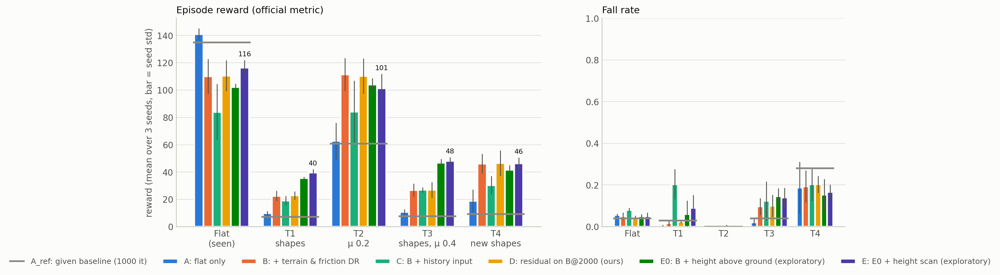
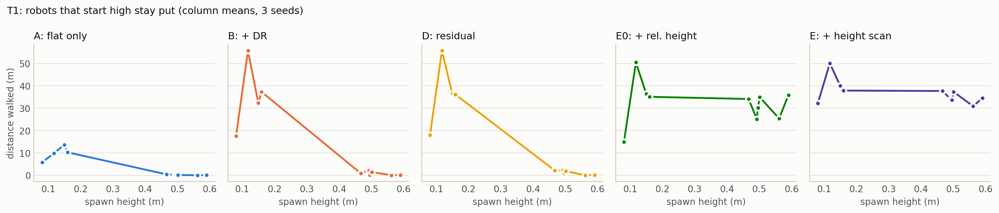
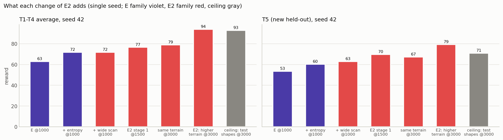
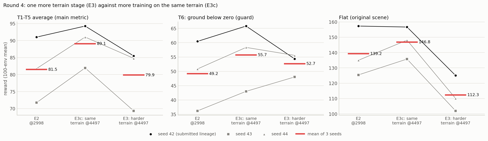
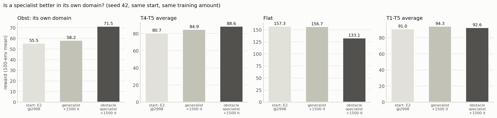
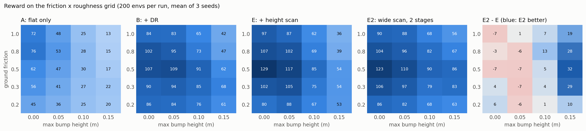
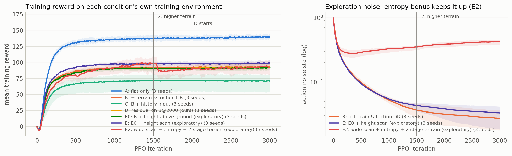

# 실습 과제 1: 처음 보는 환경에서도 잘 걷는 Ant

**한눈에 보기**

- 제공된 PPO baseline은 처음 보는 지형에서 거의 걷지 못합니다(T1~T4 평균 21.2). 진단해 보니 원인은 **"높은 곳에서 출발하면 얼어붙는 것"** 이었습니다. 관측의 몸통 높이가 월드 z 절대값이라 학습 때 본 적 없는 입력이 되기 때문입니다.
- 원래 가설인 "명령-반응 이력으로 보정"(조건 C, D)은 같은 학습량에서 추가 이득이 없었습니다.
- **사후 탐색 실험 E:** 몸통 높이를 지면 기준으로 바꾸고 주변 지형 높이맵을 관측에 넣었습니다. T1~T4 평균이 58.8이 됐습니다.
- **사후 탐색 실험 E2:** 두 번째 진단으로 남은 손실이 "거친 지형에서 느린 것"임을 찾았습니다. 원인은 세 가지였습니다.
  - 탐색 잡음이 1000 it 무렵 사라져 학습이 멈췄습니다.
  - 높이맵이 발 디딜 곳을 11~16%만 덮었습니다.
  - 학습 지형의 높이 범위가 좁았습니다.
- 셋을 고친 E2는 **T1~T4 평균 83.2**(baseline의 3.9배)입니다. 학습 전에 새로 정한 시험 지형 **T5에서도 74.7**(E 51.2)입니다.
- **사후 탐색 실험 E3:** 학습 지형을 한 단계 더 높였습니다(3단계). 거친 형태는 좋아졌지만 평지와 저마찰을 더 크게 잃어, 같은 학습량을 2단계 지형에 더 쓴 대조군 E3c보다 낮았습니다. E3c는 세 seed 모두 E2보다 올랐지만 미리 정한 교체 문턱은 넘지 못했습니다.
- **바닥이 꺼진 지형(T6):** 넘어짐 판정이 월드 높이 기준이라, 바닥이 0 아래인 곳에서는 모든 정책이 훨씬 많이 넘어집니다. 몸통을 높이 드는 정책일수록 덜 넘어집니다.
- **제출 모델: E2 (seed 42)**, T1~T4 평균 93.9.

| 조건 | Flat | T1 형태 | T2 μ 0.2 | T3 형태+μ 0.4 | T4 새 형태 | T5 새 형태 2 | T6 꺼진 바닥 | T1~T4 평균 | T1~T5 평균 |
|---|---|---|---|---|---|---|---|---|---|
| A_ref: 제공 baseline (1000 it) | 134.9 | 7.3 | 60.8 | 7.7 | 9.2 | 11.4 | 3.7 | 21.2 | 19.3 |
| A: 평지 학습 | 141.0 ± 4.3 | 9.8 ± 1.7 | 62.8 ± 13.4 | 10.7 ± 2.2 | 19.0 ± 8.2 | 22.5 ± 8.8 | 7.1 ± 4.3 | 25.6 ± 4.4 | 24.9 ± 5.3 |
| B: + 지형·마찰 DR | 110.1 ± 12.7 | 22.5 ± 3.7 | 111.4 ± 11.9 | 26.7 ± 4.7 | 46.1 ± 7.2 | 53.0 ± 1.8 | 22.4 ± 1.9 | 51.7 ± 5.0 | 51.9 ± 4.3 |
| C: B + 명령-반응 이력 입력 | 84.1 ± 20.4 | 19.1 ± 3.3 | 84.2 ± 22.8 | 26.9 ± 1.9 | 30.5 ± 6.7 | 38.0 ± 7.1 | 14.3 ± 2.8 | 40.2 ± 5.8 | 39.8 ± 6.0 |
| D: B@2000 + 예측 오차 기반 residual 보정 | 110.5 ± 11.3 | 22.9 ± 3.0 | 110.3 ± 12.9 | 26.9 ± 5.8 | 46.5 ± 9.3 | 53.3 ± 0.8 | 23.3 ± 3.7 | 51.7 ± 4.8 | 52.0 ± 4.0 |
| E0: B + 지면 기준 높이 (사후 탐색) | 102.3 ± 2.4 | 35.6 ± 0.9 | 104.1 ± 4.6 | 46.9 ± 2.7 | 41.7 ± 3.3 | 50.6 ± 2.3 | 26.4 ± 2.3 | 57.1 ± 1.5 | 55.8 ± 1.2 |
| E: E0 + 지형 높이맵 (사후 탐색) | 116.5 ± 5.5 | 39.6 ± 2.7 | 101.3 ± 10.7 | 48.1 ± 2.7 | 46.4 ± 4.3 | 51.2 ± 1.9 | 27.4 ± 2.8 | 58.8 ± 3.6 | 57.3 ± 3.2 |
| **E2: 넓은 높이맵 + 엔트로피 + 2단계 지형 (사후 탐색 2차)** | **139.2 ± 16.4** | **61.8 ± 5.4** | 115.4 ± 25.7 | **75.6 ± 10.2** | **79.9 ± 2.1** | **74.7 ± 5.4** | **49.2 ± 12.2** | **83.2 ± 10.7** | **81.5 ± 9.6** |
| └ E2 seed 42 (제출) | 157.3 | 65.9 | 142.2 | 85.4 | 82.3 | 79.2 | 60.5 | 93.9 | 91.0 |
| E3c: E2 + 같은 지형 1500 it (사후 탐색 3차, 대조군) | 146.8 ± 10.5 | 69.3 ± 6.8 | 126.7 ± 12.8 | 83.2 ± 5.1 | 86.0 ± 3.9 | 80.3 ± 5.8 | 55.7 ± 11.6 | 91.3 ± 7.0 | 89.1 ± 6.4 |
| E3: E2 + 더 높은 지형 1500 it (사후 탐색 3차) | 112.3 ± 11.7 | 72.3 ± 4.5 | 87.0 ± 24.3 | 85.3 ± 7.5 | 82.5 ± 5.2 | 72.3 ± 4.3 | 52.7 ± 4.0 | 81.7 ± 10.4 | 79.9 ± 9.1 |
| *참고: Oracle (테스트 형태로 학습한 천장, seed 42, 제출 불가)* | *102.7* | *75.8* | *121.3* | *85.9* | *88.2* | *70.9* | *43.8* | *92.8* | *88.4* |

- 값은 평가 reward(공식 `play_one_episode.py`와 같은 누적 규칙)입니다. 각 정책을 100 env로 평가해 평균을 내고, seed 3개(42/43/44)의 평균 ± 표준편차를 적었습니다.
- 평가 조건: seed 24, 잡음 없는 정책입니다.
- 굵은 글씨는 미리 정한 비교 규칙(평균 차 > 큰 쪽 표준편차, 그리고 seed 3쌍 모두 같은 방향)으로 E2 > E인 칸입니다. T2는 규칙상 차이가 없습니다.
- T6는 E3를 학습하기 전에 정한 네 번째 시험 지형입니다. 그래서 모든 조건을 나중에 T6에서 다시 평가했습니다.
- 전체 표(본 계획의 T1~T3 평균 포함), 넘어짐 비율, 전진 거리, 사전 등록 비교는 [results/summary.md](results/summary.md)에 있습니다.

## 1. 평가 방법 (조교님용)

```bash
conda activate lerobot-arena
cd ~/IsaacLab_RS

./isaaclab.sh -p scripts/reinforcement_learning/rsl_rl/play_one_episode.py \
  --task Isaac-Ant-WideScan-v0 \
  --seed 24 \
  --num_envs 100 \
  --checkpoint assignments/hw1_ant/checkpoints/E2_seed42/model.pt \
  --video \
  --video_length 960
```

- 같은 내용이 [EVAL_COMMAND.txt](EVAL_COMMAND.txt)에 있습니다. 원본 평지에서 이 명령의 결과는 157.30 ± 31.01입니다.
- **task와 지형:** `Isaac-Ant-WideScan-v0`는 원본 `Isaac-Ant-v0` 설정을 상속하고 레이캐스트 센서만 추가한 task입니다.
  - 지형, reward, 종료 조건, 에피소드 길이, 로봇은 원본과 같습니다.
  - 원본 `source/isaaclab_tasks/isaaclab_tasks/manager_based/classic/ant/ant_env_cfg.py`의 지형(`MySceneCfg.terrain`)과 지형 물성만 바꾸면 이 task도 그 지형에서 평가됩니다.
  - 센서는 Isaac Lab 지형의 기본 경로인 `/World/ground`를 읽습니다. 평면 지형과 생성 지형 모두 동작합니다.
- **저장소 위치:** conda env `lerobot-arena`의 Isaac Lab은 `~/IsaacLab_RS/source`를 가리킵니다. 이 저장소를 `~/IsaacLab_RS`에 받아 주세요.
  - 다른 위치에 받았다면 명령 앞에 `PYTHONPATH=<저장소>/source/isaaclab_tasks:$PYTHONPATH`를 붙이면 그 위치의 task가 쓰입니다.
- **원본 task 이름(`Isaac-Ant-v0`)으로만 평가해야 하는 경우:** 원본 관측 그대로인 조건 B를 쓰면 됩니다.
  - `--task Isaac-Ant-v0 --checkpoint assignments/hw1_ant/checkpoints/B_seed44/model.pt`
  - T1~T4 평균은 51.7로 E2(83.2)보다 낮습니다.

## 2. 문제와 가설

- 평가 reward의 대부분은 목표 방향 전진 거리(m)입니다. 생존 관련 항은 모두 합쳐도 최대 17.6점입니다.
- 넘어지거나 멈추면 그 뒤의 점수를 잃습니다. 몸통 높이 0.31 m 미만(월드 z 기준)이면 넘어진 것으로 보고 에피소드가 끝납니다.

> **원래 가설 (사전 등록).** PPO baseline이 처음 보는 환경에서 무너지는 이유는 지금 어떤 환경인지 알 수 없기 때문이다. 최근의 명령과 실제 반응을 보고 걸음을 보정하면 일반화가 개선된다.

| 조건 | 바꾼 한 가지 | 답하는 질문 |
|---|---|---|
| A | (원본) 평지, 마찰 1.0에서 3000 it | 출발점 |
| B | A + 지형·마찰 domain randomization | 다양한 환경 경험만으로 충분한가 (H1) |
| C | B + 최근 15 step의 명령·반응 이력 입력 (510차원) | 이력 정보가 도움이 되는가 (H2) |
| D | B@2000 고정 + 보정 Δa를 1000 it 학습, 보정 강도 α = 동역학 예측 오차 | 기본 걸음과 보정을 분리하면 나은가 (H3, H4) |

- **D의 구조:**
  - `a = π_base(o) + α·Δa`이고, 토크는 7.5·a(원본과 같은 scale)입니다.
  - α는 평지에서 학습한 동역학 모델의 최근 1초 예측 오차로 정하며, 학습하지 않습니다.
  - 라이브러리를 고치지 않고 커스텀 action term으로 구현했습니다. 최종 행동을 action 버퍼에 되써서 원본 reward의 행동·에너지 벌점이 실제 적용 행동으로 계산됩니다.
- **공정성:** 모든 조건은 PPO 3000 iteration입니다(D는 B의 2000 + 1000, E2는 1단계 1500 + 2단계 1500). reward와 관측 정규화(끔)가 같고, B~E2는 같은 학습 지형에서 출발합니다.
- **사전 등록:** 실험 전에 가설, 수치 예측, 비교 규칙("평균 차 > 표준편차이면서 seed 3쌍 모두 같은 방향")을 정하고 동결했습니다.
  - E와 E2는 결과를 본 뒤의 **사후 탐색 실험**입니다.
  - 그래서 각각 학습 전에 별도 계획(가설, 예측, 새 테스트 지형 T4·T5, 제출 규칙)을 다시 동결했습니다.

## 3. 학습 환경과 자체 "처음 보는 환경"

**학습 환경 (B, C, D, E0, E, E2 1단계 공통):**

- 8 m 타일 24행 × 8열(+x 192 m)이고 타일마다 종류와 난이도가 랜덤입니다.
- 구성은 평지 20%, 요철 30%(0.01~0.08 m), 파형 20%(0~0.08 m), 낮은 장애물 15%(0.02~0.10 m), 완만한 경사 15%입니다.
- 마찰은 env마다 0.3~1.2이고, 학습 env에서만 로봇 재질로 랜덤화했습니다.
- 넘어짐 판정이 월드 z 기준이라 모든 지형 높이를 0 이상으로 만들었습니다(학습된 Ant의 몸통은 0.38~0.50 m에서 걷습니다).
- **E2의 2단계(DR-Hard):** 같은 다섯 종류에서 높이 범위만 넓혔습니다. 요철·파형 최대 0.12 m, 장애물 0.20 m, 경사 0.30입니다. 요철은 T1(0.13~0.16 m)보다 낮게 두었고, 테스트 지형의 형태는 넣지 않았습니다.
- **E3의 3단계(DR-Harder):** 장애물을 0.30 m(40개), 경사를 0.45까지 높이고, 평지 비율을 10%로 줄이고, 난이도 0.25 미만의 타일을 뺐습니다. 요철과 파형은 T1·T5 보호를 위해 2단계 그대로입니다.

**처음 보는 환경 (학습에 사용하지 않음):**

| 환경 | 내용 |
|---|---|
| Flat | 원본 평지 (마찰 1.0) |
| T1 | 학습에 없던 피라미드 계단, 박스 격자, 더 큰 요철. 출발점의 60%가 0.5 m 안팎의 높은 곳 |
| T2 | 평지, 마찰 0.2 (학습 범위 밖) |
| T3 | T1 지형, 마찰 0.4 |
| T4 | (E 학습 전에 정의) 솟은 상자(0.22~0.30 m) 위 출발, 레일, 원기둥 장애물 |
| T5 | (E2 학습 전에 정의) 원뿔, 기울어진 상자, 긴 파형(최대 0.2 m). 로봇 100대가 서로 다른 100개 타일에서 출발 |
| T6 | (E3 학습 전에 정의) **바닥이 0 아래로 꺼진 지형**: 진행 방향을 가로지르는 도랑, 사각 구덩이, T1 요철을 그 높이만큼 내린 것. 깊이 0.125~0.20 m, 출발 지면은 높이 0 |

- T1~T3는 A_ref만 보고 "평지의 50% 이하"가 되도록 정했고, 이후에는 바꾸지 않았습니다.
- T1~T4는 출발점이 10곳(열 10개 × 로봇 10대)입니다. T5는 출발점을 100곳으로 늘렸습니다.
- 분석용 환경도 있습니다. Grid(요철 높이 × 마찰 heatmap), Switch(5초에 마찰 1.0 → 0.25), Obst(2단계 장애물만, 전문 정책 비교용)입니다.
- 이 저장소의 학습 지형은 모두 바닥이 0 이상입니다. 넘어짐 판정이 월드 높이 0.31 m 기준이라, 꺼진 바닥에서는 같은 걸음이어도 판정선에 가까워집니다. T6는 이 위험을 재려고 만들었습니다.

## 4. 결과와 분석



1. **H1 지지.** B는 A보다 T1~T5에서 모두 좋습니다(사전 규칙 충족). 대가로 평지 점수가 22% 낮아지는 "타협형 걸음"이 됩니다.
2. **H2 기각.** C는 B보다 낮습니다. 입력이 8.5배(510)로 커졌는데 학습량은 같아 학습이 느리고 seed 편차가 컸습니다.
3. **H3, H4: D는 B와 차이가 없습니다**(D와 출발점 B@2000도 차이 없음).
   - α는 평지에서 0.02로 꺼지고, 처음 보는 형태(T1·T3)에서 0.2, T4에서 0.36으로 켜집니다.
   - 그러나 마찰 변화(T2, 마찰 전환)에는 거의 반응하지 않았습니다. 동역학 예측 오차가 미끄러짐보다 지형 충격에 반응했기 때문입니다.
   - 낯선 지형에서 실제 적용된 보정량은 기본 행동의 12~16%였지만 성능을 바꾸지 못했습니다.
4. **진단 1: 높은 곳에서 출발하면 얼어붙습니다.**
   - T1에서 출발 높이와 전진 거리의 상관은 모든 정책에서 −0.73 ~ −0.84입니다.
   - 계단 꼭대기(0.5~0.6 m)에서 출발한 B는 16초 동안 0 m를 갑니다.
   - **근거:** 원본 관측의 첫 항은 몸통의 월드 높이입니다. 같은 자세여도 계단 위에서는 학습 때 거의 본 적 없는 값(평지 0.57 m → 0.99 m)이 됩니다. 학습과 시험의 입력 분포가 다른 공변량 이동입니다(Shimodaira 2000).
     - 재학습 없이 이 관측만 출발 지점 기준으로 바꿔 평가하면 전진 거리가 +30~60% 늘었습니다.
     - 대신 넘어짐도 2% → 30~51%로 늘었습니다. 그래서 새 관측으로 다시 학습하는 E0·E를 설계했습니다.
   - D의 α는 얼어붙은 env에서 오히려 낮습니다(0.16~0.22, 걷는 env는 0.36~0.41). 멈춘 몸은 예측하기 쉬워서 보정이 꺼집니다.

   

5. **E (사후 탐색): 지면 기준 높이와 지형 높이맵.**
   - B와 비교해 T1 +76%, T3 +80%이고, 평지는 오히려 회복했습니다(110 → 117).
   - 지면 기준 높이만 바꾼 E0도 T1·T3에서 크게 좋아집니다. 개선의 대부분은 "얼어붙음 해소"에서 나왔다는 뜻입니다.
   - 한계도 있습니다. T4는 B와 같고, Grid의 가장 거친 열(0.15 m)은 B보다 낮습니다(47.4 vs 55.9, 사전 규칙상 E < B).
6. **진단 2: E의 남은 손실은 "느림"입니다.**
   - E는 거친 지형(T1, T3~T5)에서 평균 2.4~3.2 m/s로 걷습니다(평지 7.3 m/s). 넘어짐을 모두 없애도 1.5~5점만 오릅니다.
   - **탐색이 일찍 멈췄습니다.** Ant 기본 PPO 설정은 `entropy_coef = 0`입니다. 잡음 std가 0.46 → 0.05(1000 it) → 0.02(3000 it)로 줄고 학습률도 하한(1e-5)에 붙어, 1000 it 이후 학습 reward가 거의 오르지 않았습니다.
     - **근거(계산):** RSL-RL은 정책 변화(KL)가 0.01 근처가 되도록 학습률을 조절합니다. 평균이 Δμ만큼 움직일 때 KL은 Δμ²/(2σ²)입니다.
     - σ가 약 25배 줄면 같은 변화의 KL은 약 650배가 됩니다. 그래서 학습률도 약 25배 줄어야 합니다(5e-4 → 2e-5). 실제로 하한 1e-5에 붙었습니다.
     - Isaac Lab의 다리 로봇 보행 설정(ANYmal-C)은 `entropy_coef = 0.005`를 씁니다. E2는 이 값을 가져왔습니다.
   - **높이맵이 발을 못 봅니다.** Ant의 발은 몸통에서 좌우 0.3~0.95 m에 닿는데, E의 높이맵(앞뒤 1.6 m × 좌우 1.0 m)은 접지 위치의 11~16%만 덮었습니다.
     - E의 높이맵은 Isaac Lab 보행 task의 기본 크기와 같았습니다. 다리를 옆으로 넓게 벌리는 Ant에는 맞지 않았습니다.
   - **학습 지형이 낮습니다.** 학습은 최대 0.08~0.10 m, 테스트는 0.13~0.30 m입니다.
7. **E2 (사후 탐색 2차): 세 가지를 함께 고쳤습니다.**
   - **넓은 높이맵:** 몸통 뒤 1 m ~ 앞 3 m, 좌우 ±1.25 m, 0.25 m 간격 187개입니다.
   - **엔트로피 보너스:** `entropy_coef` 0.005로 잡음이 0.4 안팎으로 유지됩니다.
   - **2단계 지형:** DR 지형에서 1500 it 학습한 뒤, 높이 범위를 넓힌 DR-Hard 지형에서 이어서 1500 it를 학습합니다.
   - **결과:**
     - E2 > E(사전 규칙)가 T1, T3, T4, T5와 모든 평균에서 성립합니다.
     - 거친 지형 속도가 4.2~5.4 m/s로 E의 약 1.7배입니다.
     - T5는 51.2 → 74.7, Grid 0.15 m 열은 47.4 → 70.9입니다. E의 한계였던 거친 지형이 크게 좋아졌습니다.
     - 평지도 116.5 → 139.2로 올랐습니다.
   - **무엇이 얼마나 기여했나** (seed 42 하나라 참고용, T1~T4 평균):

     

     | 단계 | T1~T4 평균 | T5 |
     |---|---|---|
     | E @1000 it | 62.9 | 53.5 |
     | + 엔트로피 @1000 it | 71.7 (+8.8) | 60.3 |
     | + 넓은 높이맵 @1000 it | 71.7 (+0.0) | 62.9 |
     | E2 1단계 끝 @1500 it | 76.6 | 69.7 |
     | 같은 지형으로 계속 @3000 it (E2c) | 79.0 | 67.2 |
     | **높은 지형으로 계속 @3000 it (E2)** | **93.9** (E2c 대비 +14.9) | **79.2** |
     | 참고: 테스트 형태로 계속 @3000 it (Oracle) | 92.8 | 70.9 |

     - 가장 큰 기여는 엔트로피(+8.8)와 2단계 높은 지형(+14.9)입니다.
     - 넓은 높이맵은 1000 it 시점의 쉬운 지형에서는 효과가 없었습니다. 높은 지형에서의 효과는 따로 나누지 못했습니다.
     - E2(seed 42)는 테스트 형태로 직접 학습한 Oracle과 T1~T4에서 같은 수준이고, 처음 보는 T5에서는 더 좋습니다(79.2 vs 70.9).
   - **영상:**
     - 계단 꼭대기 출발 (이전 영상과 같은 출발점): [A_ref](videos/T1_A_ref.mp4), [B](videos/T1_B_seed44.mp4)는 그대로 서 있습니다. [E](videos/T1_E_seed44.mp4)와 [E2](videos/T1_E2_seed42.mp4)는 1초 안에 계단을 내려가 끝까지 걷습니다.
     - T5 같은 출발점: [E](videos/T5_E_seed44.mp4)는 43 m 지점에서 넘어지고, [E2](videos/T5_E2_seed42.mp4)는 끝까지 116 m를 갑니다.
     - 평지: [E](videos/Flat_E_seed44.mp4), [E2](videos/Flat_E2_seed42.mp4)

8. **E3 (사후 탐색 3차): 학습 지형을 한 단계 더 올리면?**
   - **설계:** E2의 마지막 체크포인트에서 1500 it를 더 학습한 조건 셋을 비교했습니다.
     - E3: 더 높은 지형(DR-Harder)
     - E3c: 같은 학습량, 2단계 지형 그대로(대조군)
     - Sobs: 2단계 지형의 장애물만(장애물 전문 정책, seed 42)
   - **아이디어:** 라운드 3에서 가장 큰 기여가 높은 학습 지형(+14.9)이었고, 남은 넘어짐이 학습 범위 밖 높이(T4 상자 0.22~0.30 m)에 몰렸습니다. 그래서 지형 커리큘럼(Rudin et al. 2021)을 한 단계 더 이었습니다.
     - E3c는 "학습량만 늘어서 좋아진 것"과 "지형이 높아서 좋아진 것"을 가르려고 함께 돌렸습니다.

     

   - **결과:** E3는 같은 학습량의 E3c보다 T1~T5 평균이 낮습니다(79.9 vs 89.1, 사전 규칙상 E3 < E3c).
     - T1(+10.5)과 T3(+9.7)은 E2보다 좋아졌습니다.
     - 대신 평지(−26.9)와 저마찰 T2(−28.4)에서 더 크게 잃었습니다. T2 넘어짐은 4% → 23%입니다.
     - 몸통을 더 높이 들고(평지 중앙값 0.59 → 0.68 m) 더 느리게 걷는 걸음이 됐습니다.
   - **E3c**는 세 seed 모두 E2보다 올랐습니다(T1~T5 +3.2 / +10.2 / +9.2). 그러나 평균 차(7.6)가 seed 간 표준편차(9.6)보다 작아 사전 규칙상 "경향"입니다.
   - **제출:** 미리 정한 교체 규칙의 첫 조건(T1~T5에서 규칙상 후보 > E2)을 넘지 못해 **E2 seed 42를 유지**했습니다. 측정상으로는 E3c seed 42가 조금 높습니다(T1~T5 94.3 vs 91.0).
9. **꺼진 바닥(T6)의 위험**
   - 모든 조건이 T1보다 T6에서 훨씬 많이 넘어집니다: A_ref 92%, B 74%, E 58%, E2 43%, E3 37%(T1에서는 0~20%).
   - 평지에서 몸통을 높이 드는 조건일수록 T6에서 덜 넘어집니다(10개 조건의 순위 상관 −0.96). 넘어짐 판정이 월드 높이 기준이라, 바닥이 꺼진 만큼 판정선까지의 여유가 줄기 때문입니다.
   - 제출 모델(E2 seed 42)도 T6에서는 31%가 넘어집니다(T1 7%). 조교님 지형에 꺼진 곳이 많으면 점수가 낮아질 수 있습니다.
10. **전문가 증류의 전제 시험 (seed 42 하나, 참고)**
    - 증류는 지형별 전문 정책을 하나로 합치는 방법입니다(Zhuang et al. 2023; Rudin et al. 2025). 전문 정책이 범용 정책보다 나아야 의미가 있습니다.
    - 기존 정책끼리는 보완하는 지형이 없었습니다. 시험 지형마다 E2와 E2c 중 나은 쪽을 골라도 T1~T5는 91.0으로 E2 혼자와 같습니다.
    - 장애물 전문 정책은 자기 분야(Obst)에서 범용 정책보다 +22.8%였지만, 처음 보는 비슷한 형태(T4·T5)에서는 +3.8점이었습니다. 사전 규칙상 "지금 근거로는 이득이 작음"입니다.

    





**한계**

- E와 E2는 결과를 본 뒤 설계한 사후 실험입니다. 학습 전에 새 테스트 지형(T4, T5)을 정해 따로 검증했지만, 본 가설의 판정과는 구분해야 합니다.
- E2는 seed 편차가 큽니다(T1~T4 평균 93.9 / 72.5 / 83.2). 평지에서 넘어짐도 늘었습니다(5% → 14%). 더 빠른 걸음의 대가로 보입니다.
- T2(마찰 0.2)는 E2도 규칙상 E와 차이가 없습니다. 마찰에 민감한 감지(예: 발 미끄러짐 속도)는 다루지 못했습니다.
- E2 기여 분해는 seed 하나의 결과입니다.
- seed 3개라 통계적 검정력이 낮습니다.
- 넘어짐 판정 자체가 월드 z 기준이라, 지면보다 낮은 곳이 있는 지형에서는 잘 걸어도 종료될 수 있습니다. T6에서 확인했고(E2 넘어짐 43%), 꺼진 바닥을 학습에 넣는 실험은 하지 않았습니다.
- E3·E3c도 사후 실험입니다. 학습 전에 계획서를 동결하고 새 시험 지형 T6를 정했습니다. 전문 정책 시험은 seed 하나입니다.

## 5. 저장소에 추가한 것

원본 Isaac Lab 파일은 수정하지 않았습니다(루트 README 맨 위 안내 블록과 `.gitignore` 제외).

```
source/isaaclab_tasks/isaaclab_tasks/manager_based/classic/ant_robust/   [신규] 과제 1 환경 패키지
├── __init__.py              task 등록 (학습 10, 평가 5, 테스트·분석 54)
├── env_cfgs.py              원본 AntEnvCfg 상속: 관측(C, D, E0, E, E2), 행동(D), 레이캐스트 센서, DR 학습, 테스트 지형
├── terrains.py              DR 학습 지형, DR-Hard(E2 2단계), DR-Harder(E3 3단계), 장애물 전용, T1~T6, Oracle, Obst, Grid, Switch
├── agents/rsl_rl_ppo_cfg.py PPO 설정 (3000 it, D는 1000 it·noise 0.2·lr 1e-4, E2는 단계마다 1500 it·entropy 0.005)
├── mdp/observations.py      반응 상태, 원본 관측 재계산, 기본 정책 행동, 지면 기준 높이
├── mdp/events.py            로봇 마찰 랜덤화 (학습 env 전용), T5·T6·Obst 출발점 분산
├── mdp/models.py            고정 MLP, 동역학 모델, 이력·오차 버퍼
├── mdp/residual_action.py   D의 action term
└── weights/                 D용 기본 정책(B@2000 actor)과 동역학 모델 (seed별)
assignments/hw1_ant/                                                       [신규]
├── README.md, EVAL_COMMAND.txt
├── checkpoints/<조건>_seed<S>/model.pt (+ params/)    A, B, C, D, E0, E, E2, E3, E3c × seed 3개와 Oracle_seed42, Sobs_seed42의 최종 가중치
├── scripts/                 실행·평가·분석 스크립트 (아래 6장)
├── results/                 summary.md, main_runs.csv, grid_runs.csv, submission.json, dynamics/, diagnosis/, raw/
└── figures/, videos/
```

## 6. 재현 방법

모든 Isaac 실행은 `scripts/isaac_run.sh`로 감쌌습니다. 이 래퍼는 conda 활성화, GPU 선택(`GPU=<번호>`), 출력 버퍼 해제, RAM 기반 동시 실행 제한을 처리합니다. 래퍼 없이 `./isaaclab.sh -p ...`로 실행해도 됩니다.

```bash
T=scripts/reinforcement_learning/rsl_rl/train.py
./isaaclab.sh -p $T --task Isaac-Ant-v0 --headless --seed 42 --max_iterations 3000 --run_name A_seed42   # A
./isaaclab.sh -p $T --task Isaac-Ant-DR-v0 --headless --seed 42 --run_name B_seed42                       # B
./isaaclab.sh -p $T --task Isaac-Ant-Hist-DR-v0 --headless --seed 42 --run_name C_seed42                  # C
bash assignments/hw1_ant/scripts/pipeline_d.sh 42                                                         # D (B@2000 필요)
./isaaclab.sh -p $T --task Isaac-Ant-RelHeight-DR-v0 --headless --seed 42 --run_name E0_seed42            # E0
./isaaclab.sh -p $T --task Isaac-Ant-Scan-DR-v0 --headless --seed 42 --run_name E_seed42                  # E
python assignments/hw1_ant/scripts/pipeline_e2.py      # E2 1단계 → 2단계(재개 학습), 진단 run, Oracle, 평가까지 한 번에
python assignments/hw1_ant/scripts/pipeline_e3.py      # E3·E3c·Sobs(E2에서 재개 학습)와 T6·Obst 평가까지 한 번에
python assignments/hw1_ant/scripts/sweep_eval.py jobs --out jobs.jsonl                                    # 평가 목록
python assignments/hw1_ant/scripts/run_queue.py jobs.jsonl --gpus 0                                       # 평가 실행
python assignments/hw1_ant/scripts/sweep_eval.py aggregate && python assignments/hw1_ant/scripts/plots.py # 표·그림
python assignments/hw1_ant/scripts/select_submission.py                                                   # 제출 선택
```

E2를 손으로 돌릴 때는 1단계(`Isaac-Ant-WideScan-DR-v0`, 1500 it) 뒤에 2단계를 재개 학습으로 실행합니다.

```bash
./isaaclab.sh -p $T --task Isaac-Ant-WideScan-DR-v0 --headless --seed 42 --run_name E2s1_seed42
./isaaclab.sh -p $T --task Isaac-Ant-WideScan-DRHard-v0 --headless --seed 42 --run_name E2_seed42 \
  --resume --load_run <E2s1_seed42 폴더 이름 전체> --checkpoint model_1499.pt
```

## 7. 규칙 준수

- **평가 reward 식:** 바꾸지 않았습니다. 원본 7개 항을 그대로 상속합니다.
- **로봇 USD:** 수정하지 않았습니다.
- **물성:** 학습 환경에서만 로봇 마찰을 랜덤화했습니다. 평가 task는 로봇 물성을 바꾸지 않습니다.
- **추가한 센서:** 레이캐스트로 지형 형태만 측정합니다(관측 구성은 과제에서 허용).
- **제출 모델 선택:** 결과를 보기 전에 정한 규칙을 따랐습니다. E2는 "T1~T4 평균에서 규칙상 E2 > E이고 T5에서 규칙상 E2 < E가 아님"을 만족해 E를 대체했습니다. seed는 학습 reward로 골랐습니다(테스트 지형 미사용).
  - E3·E3c는 "T1~T5에서 규칙상 E2보다 낫고, T6에서 나쁘지 않고, 고른 seed가 지금 제출 모델 이상"이어야 교체하기로 정했습니다. 후보 E3c가 첫 조건에서 "경향"에 그쳐 교체하지 않았습니다.
- **Oracle:** 테스트 지형과 같은 형태로 학습한 "천장 참고값"입니다. 점수 해석에만 쓰고 제출 후보에서 뺐습니다. 장애물 전문 정책 Sobs도 진단용이라 후보가 아닙니다.
- **코드 작성:** 논문과 공개 프로젝트는 아이디어만 참고했고 코드는 직접 작성했습니다.

## 8. 참고 문헌 (아이디어만 참고)

- J. Lee et al., "Learning quadrupedal locomotion over challenging terrain," *Science Robotics*, 2020. DR 지형 학습
- N. Rudin et al., "Learning to Walk in Minutes Using Massively Parallel Deep RL," *CoRL*, 2021. 병렬 PPO, 지형 생성기, 높이맵 관측, 지형 커리큘럼
- J. He et al., "Attention-based map encoding for learning generalized legged locomotion," *Science Robotics*, 2025. 발 디딜 곳을 보는 지형 지도
- T. Miki et al., "Learning robust perceptive locomotion for quadrupedal robots in the wild," *Science Robotics*, 2022. 몸의 감각과 주변 지형 높이를 함께 쓰는 보행 정책
- H. Shimodaira, "Improving predictive inference under covariate shift by weighting the log-likelihood function," *J. Statistical Planning and Inference*, 2000. 공변량 이동(월드 높이 관측의 문제)
- J. Schulman et al., "Proximal Policy Optimization Algorithms," arXiv:1707.06347, 2017. 탐색을 위한 엔트로피 보너스
- Z. Zhuang et al., "Robot Parkour Learning," *CoRL*, 2023. 기술별 전문 정책의 DAgger 증류
- N. Rudin et al., "Parkour in the Wild: Learning a General and Extensible Agile Locomotion Policy Using Multi-expert Distillation and RL Fine-tuning," arXiv:2505.11164, 2025. 지형별 전문 정책 증류
- A. Kumar et al., "RMA: Rapid Motor Adaptation for Legged Robots," *RSS*, 2021. 이력으로 숨은 환경 정보 추정
- I. M. Aswin Nahrendra et al., "DreamWaQ," *ICRA*, 2023. 이력 기반 추정과 신뢰도 조절
- J. Long et al., "Hybrid Internal Model (HIM)," *ICLR*, 2024. 명령-반응 이력
- T. Silver et al., "Residual Policy Learning," arXiv:1812.06298, 2018. 기본 제어기 위 residual 보정
- T. Johannink et al., "Residual Reinforcement Learning for Robot Control," *ICRA*, 2019.
